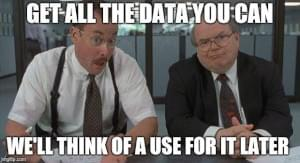

I have been doing Udemy lesson on Web Scraping with Python for the last 3 weeks, specifically using Beautiful Soup and Selenium. I became interested in the topics of ethics and the related lawsuits behind this method. And [this story about a data-entry clerk](https://workplace.stackexchange.com/questions/93696/is-it-unethical-for-me-to-not-tell-my-employer-i-ve-automated-my-job) secretly wrote a program to automate his tasks without sharing with the employer is especially interesting to read and discuss. 

#### Some projects were super fun such as:
- Top 100 famous movies to watch before you die
- [Create a custom Spotify playlist from Billboard100](https://github.com/slimrivermoi/Top100-spotify-playlist/blob/main/main.py) based on custom date
- [Instant Pot price watch](https://github.com/slimrivermoi/amazon-price-alert/blob/main/main.py) (I am a long-time IP fan)
   

#### While others are just not my cup of tea...
- Cheat in a cookie clicking game -- Where is the fun to click mindlessly over a virtual cookir?! None, absolutely none.
- Auto apply in job on Linkedin -- don't you want to know what you've just applied for?
- Tinder auto-swiping to increase your matching chance -- try explaining that to your partner
- Twitter (now X) complain Bot to put more junk on social media -- OK. this is not that bad or evil. 
- auto-clicking on IG to get more followers -- so you want to be liked?!

As Uncle Ben told young Peter Parker: 
> "With great power comes great responsibility".

It is a great reminder to think of the endless possibilities of the new knowledge you have acquired but do it with good intention.
