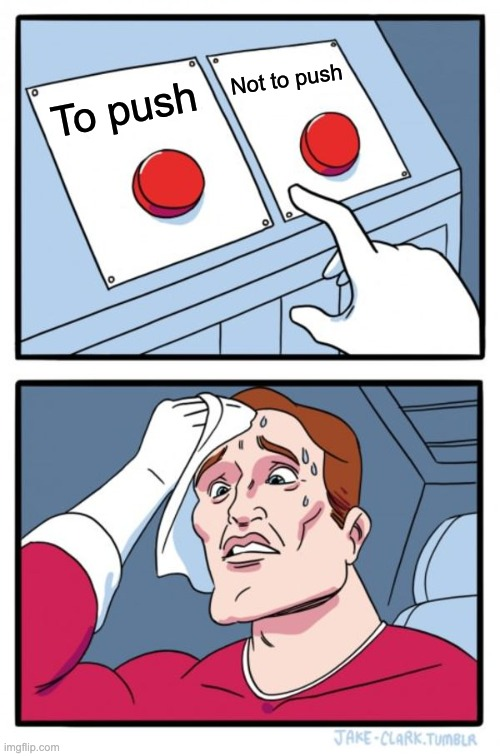

I have been doing Udemy lesson on Web Scraping with Python in the last 3 weeks, specifically using Beautiful Soup and Selenium. I became interested in the topics of ethics and the related lawsuits behind this method. 

Some projects were super fun such as:
1. Top 100 famous movies to watch before you die
2. Create a custom Spotify playlist from Billboard 100 based on custom date
3. Instant Pot price watch (I am a long-time IP fan)

While others are just not my cup of tea.
1. Cheat in a cookie clicking game -- Where is the fun to click mindlessly over a cookie to win something you cannot have?!
2. Auto apply in job on Linkedin -- don't you want to know what you've just applied for?
3. Tinder auto swiping to increase your matching chance -- try explaining that to your partner
4. Twitter (now X) complain Bot to put more junk on social media 
5. auto clicking on IG to get more followers -- so you want to be liked?!

